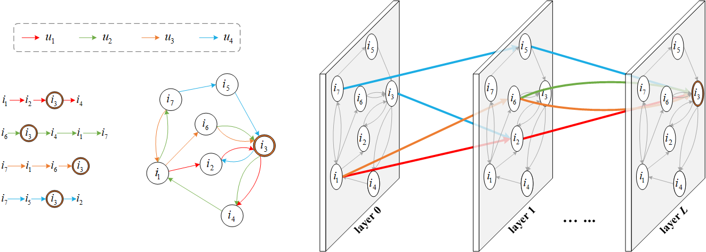

# SGAT

<!-- Sequential Graph Collaborative Filtering -->
Sequential Graph Attention Network



Understanding collaborative and sequential information plays a major role in next-item recommendation.
Although previous models have achieved considerable results, their capabilities have been limited by the basic paradigm of characterizing each user's profile with only his/her sequential behaviors.
This paper considers collaborative information over users to solve the problem.
Specifically, we first reorganize all interactions as a multiplex directed heterogeneous graph (named sequential graph) to depict each user's sequential behaviors and all users' collaborative interactions.
Second, we propose a generic vectorization algorithm to address the challenge of multiplex edges.
The algorithm can implement arbitrary graph attention networks on complex graphs without graph simplification.
Finally, we propose a novel sequential graph attention network (SGAT) that controls information to attentively propagate through directed heterogeneous edges.
Based on the sequential graph and the vectorization algorithm, SGAT infers each user's dynamic preference by capturing high-order sequential information among items and exploiting both latitudinally and longitudinally collaborative information over users.
Extensive experiments and ablation studies on various datasets demonstrate the superiority of SGAT.
The sequential graph provides an alternative way to organize users' sequential behaviors and the vectorization algorithm can promote the development of graph mining by retaining topological structures of complex graphs.

## Highlights
- A sequential graph is introduced to reorganize all user-item interactions.
- An algorithm is proposed to vectorize graph attention networks on complex graphs.
- A personalized and transition-aware attention mechanism is proposed.
- The proposed SGAT model explicitly captures collaborative and sequential information.

## Requirements

We provide TensorFlow implementations for SGAT model.

- Python==3.6
- TensorFlow==1.14
- RecKit==0.2.4

**Note**:

- The current code works well with TensorFlow 1.14
- [RecKit](https://github.com/ZhongchuanSun/reckit) provides an efficient evaluator that is implemented with C++ code. 

## Run

```bash
python run_model.py
```

## Citation

If you find this useful for your research, please kindly cite the following paper.

```bibtex
@article{ins:2022:sgat,
title = {Sequential Graph Collaborative Filtering},
author = {Sun, Zhongchuan and Wu, Bin and Wang, Youwei and Ye, Yangdong},
journal = {Information Sciences},
volume = {},
pages = {},
year = {2022}
}
```
